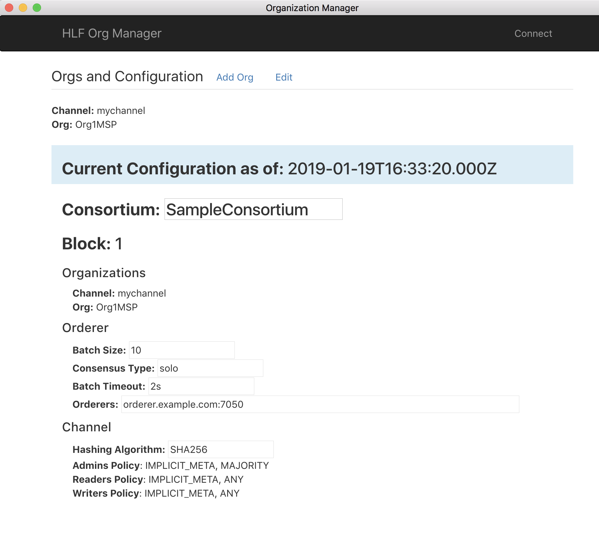

# byzantine-config-source

Hyperledger Fabric Network Configuration Manager allowing configuration blocks to be created to add Organizations, and update network configuration properties.

Implements a Desktop application using Electron and ReactJS.  

### Installing and Starting 

    $ npm install 

    $ npm run electron-dev
       
### Build Exectuable 

    $ sudo npm run electron-pack 

Binaries are created in the `dist` folder.  Pre built executable binaries can be found at [here](https://github.com/in-the-keyhole/byzantine-config);

### Usage 

Updating a Hyperledger Fabric network configuration and adding/updating organizations requires a configuration block to be defined, signed and then executed as an update config transaction. Doing this manually with CLI tools can be complex and cumbersome.   

Byantine-config provides an executable `GUI` application that simplifies greatly updating and adding Organizations. When invoked an initial connect screen will appear.  You will need a network peer node address, Userid, access to your private key, and Fabric Binaries 

Once connected the current configuration block is displayed... 

Clicking the `add` and an org link will prompt for new Org name and properties, input desired values then click generate.

Crypto artifacts for the new Org and an `updated config block` will be generated. The config block '< > ' will need to be signed by the consortiume 

